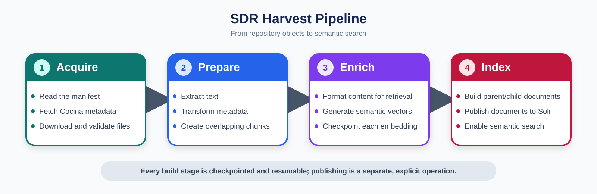

# SDR Harvest

SDR Harvest builds searchable Solr documents from Stanford Digital Repository
objects.

The pipeline has four broad phases:

1. **Acquire** — Read the manifest, fetch Cocina metadata, and download
   validated source files.
2. **Prepare** — Extract text, transform metadata, and divide the content into
   overlapping chunks.
3. **Enrich** — Generate a semantic vector embedding for every chunk.
4. **Index** — Create nested parent/child Solr documents and publish them to the
   search collection.

Every build stage is checkpointed and resumable; publishing is a separate,
explicit operation.



## Quick start

Install dependencies:

```shell
uv sync
```

Build the corpus, inspect failures, and retry them:

```shell
LITELLM_API_KEY=<key> uv run sdr-harvest run \
  --manifest manifest.csv --workers 7

uv run sdr-harvest status --failed
LITELLM_API_KEY=<key> uv run sdr-harvest retry --failed
```

Building creates local Solr JSON documents. It does not write to Solr. Use the
separate `publish` command after reviewing the build results.

## Prepare the manifest

The pipeline accepts one authoritative manifest. If the desired corpus comes
from multiple CSV exports, merge them into a sorted, deduplicated manifest:

```shell
uv run sdr-harvest merge-manifests \
  world-readable-document-type-with-pdf.csv \
  oral-history-ts561xq4138-druids.csv \
  --output manifest.csv
```

Use the same merged manifest for later build and publish commands. Switching to
a different manifest marks objects omitted from it as absent, but does not
delete their local artifacts or their documents in Solr.

To preview additions, omissions, and known failures:

```shell
uv run sdr-harvest plan --manifest manifest.csv
```

## Build Solr documents

The main build command is:

```shell
LITELLM_API_KEY=<key> uv run sdr-harvest run \
  --manifest manifest.csv --workers 7
```

The progress display begins with fully current objects already counted as
complete and queues only objects that may need work. The command safely reuses
completed downloads, extracted text, chunks, embeddings, and Solr documents.
When an SDR object changes, a new version is built without overwriting its
previous artifacts.

For Cocina books with one transcription XML file for every PDF page, the build
downloads and extracts the page-level ALTO OCR instead of the image-heavy PDFs.
If the ALTO inventory is incomplete, the build falls back to the selected PDF.
Other object types continue using PDF extraction.

Press Ctrl-C once to cancel queued work and exit. Running the command again
resumes from completed stages. Use `--no-progress` for redirected logs or a
scheduler.

Document vectors are requested in batches of up to 50, with at most two batch
requests in flight, from the Stanford LiteLLM Gemini API passthrough using
`gemini-embedding-2` at 768 dimensions. Inputs are formatted as
`title: <title> | text: <chunk>`. A question-answering client must use the same
model and dimensions and format query text as
`task: question answering | query: <question>`.

Each completed vector is checkpointed in the object's version directory. If an
embedding request fails, a retry resumes with only the missing chunks. A change
to the ordered embedding inputs, model, or dimensions invalidates that
checkpoint automatically.

## Inspect and retry failures

Show every failure or inspect one object:

```shell
uv run sdr-harvest status --failed
uv run sdr-harvest status --druid zd240tq9137
```

Transient service and network failures are retried automatically. Remaining
failures can be retried together:

```shell
LITELLM_API_KEY=<key> uv run sdr-harvest retry --failed
```

PDF downloads are streamed to disk and checked against the size, SHA-1, and
MD5 declared by COCINA. Integrity failures report every expected and calculated
value. The invalid download is deleted by default; retain it for diagnosis by
adding `--keep-failed-downloads` to `run`, `retry`, or `rebuild`. Retained files
are stored beside the intended PDF with an `.invalid` suffix and can be very
large.

To deliberately rebuild one object from a particular stage:

```shell
LITELLM_API_KEY=<key> uv run sdr-harvest rebuild \
  --druid zd240tq9137 --from extract
```

## Publish to Solr

Publish completed documents to staging only after the build has been reviewed:

```shell
uv run sdr-harvest publish \
  --manifest manifest.csv \
  --target https://solr-stage.example.edu/solr/sdr-search \
  --workers 7
```

Publication state is tracked by both DRUID and target URL. Repeating this
command skips unchanged documents already published successfully to that
target, retries failures, and publishes changed documents. Currency is based on
the generated `solr.json` fingerprint, so changes to metadata, chunking,
embeddings, or document construction require publication even when the SDR
source itself is unchanged. Use `--force` to republish documents that are
already current.

Documents are sent in batches of up to 25 objects or 25 MB, whichever limit is
reached first. Each successful update uses `commitWithin=60000`, so the client
does not issue hard commits and documents may take up to one minute to become
searchable. Solr's successful HTTP response is treated as acceptance; the
publisher does not query each document afterward. Use `--batch-size` and
`--max-batch-mb` to tune the limits for a particular Solr installation.

To publish from another machine, copy the application, `manifest.csv`, and the
complete `.sdr-harvest/` directory to it. Then publish to production:

```shell
uv run sdr-harvest publish \
  --manifest manifest.csv \
  --target https://solr-prod.example.edu/solr/sdr-search \
  --workers 7
```

Staging and production have independent publication records, so success on
staging does not cause production to be skipped. Publishing uses the documents
already built and does not require a LiteLLM key.

When publishing through a trusted local SSH tunnel, a `localhost` URL will not
match the certificate issued to the remote Solr hostname. TLS verification can
be disabled explicitly for that tunnel:

```shell
uv run sdr-harvest publish \
  --manifest manifest.csv \
  --target https://localhost:8983/solr/semantic-search-demo \
  --workers 4 \
  --insecure
```

`--insecure` accepts any certificate presented through the connection. Use it
only with a tunnel you created and trust; normal publication keeps certificate
verification enabled.

We often use:
```shell
ssh -N -L 8983:<remote_host>:443 semantic-search-demo.stanford.edu
```

## Evaluate retrieval quality

To inspect one query manually, use the same semantic retrieval path as the
evaluator:

```shell
LITELLM_API_KEY=<key> uv run sdr-harvest query \
  "What was Stanford's role in the development of Silicon Valley?"
```

The command displays the ranked DRUIDs with their similarity scores, source
filenames, chunk indexes, and matching text. Results are collapsed to the best
chunk per DRUID, just as they are during evaluation. Use `--limit 20` to show
more objects, `--candidates 200` to expand the chunk candidate pool, or
`--json` for machine-readable output. To query another collection, pass its
full URL with `--target`.

Keep a reviewed set of natural-language queries and relevant SDR objects in a
JSON array of test cases (see
[`evaluations/test-cases-schema.md`](evaluations/test-cases-schema.md) for the
full field reference). Each case has a stable test ID, a query, and a
`judgments` array of `{document_id, score, explanation}` graded `0`-`3`, with
`3` for highly relevant, `2` for relevant, and `1` for marginally relevant:

```json
[
  {"test_id":"water-policy-1","subject_id":"water-policy","query":"How did water policy affect California agriculture?","judgments":[{"document_id":"cc333dd4444","score":3,"explanation":"..."},{"document_id":"ee555ff6666","score":1,"explanation":"..."}]}
]
```

Test cases live under [`evaluations/judgments/`](evaluations/judgments/),
one file per subject named after its `subject_id` (e.g. `john-lynch.json`).
Create a new file for a new subject, or add miscellaneous judgments to `judgments.json`.

Run an evaluation against the local collection and save it as the baseline for
the current pipeline. Pointing `--judgments` at the `judgments` directory
evaluates every subject together; pointing it at one file evaluates just that
subject:

```shell
LITELLM_API_KEY=<key> uv run sdr-harvest evaluate \
  --judgments evaluations/judgments \
  --output evaluations/baseline.json
```

The evaluator embeds queries with the same Gemini model as the pipeline,
retrieves chunk candidates from Solr, and collapses them by DRUID before
scoring. This prevents documents with more chunks from occupying multiple
ranking positions. It reports these metrics at ranks 1, 5, and 10 by default:

- `success`: fraction of queries with at least one relevant result;
- `recall`: fraction of all judged-relevant objects retrieved;
- `mrr`: how early the first relevant result appears;
- `ndcg`: ranking quality that gives more credit to highly graded results.

After changing extraction, chunking, metadata, embeddings, or Solr behavior,
rebuild and publish the affected corpus, then compare with the saved baseline:

```shell
LITELLM_API_KEY=<key> uv run sdr-harvest evaluate \
  --judgments evaluations/judgments \
  --output evaluations/candidate.json \
  --baseline evaluations/baseline.json \
  --fail-on-regression ndcg@10 \
  --regression-tolerance 0.01
```

The command exits with status 2 when the selected metric decreases by more than
the tolerance, which makes it suitable for a release check. The full JSON
report includes aggregate deltas and each query's ranked DRUID, best chunk,
score, filename, and snippet for diagnosis. Use `--cutoffs` to change the
reported ranks and `--candidates` to change how many chunks are retrieved
before collapsing.

Treat the judgment file as a maintained test fixture: include representative
query types, difficult terminology, known near-misses, and more than one
relevant object where appropriate. Keep the file fixed while comparing two
pipeline versions; the evaluator rejects a baseline made with different
judgments or metrics.

## State and intermediate data

By default, all managed state is stored in `.sdr-harvest/`, including:

- the SQLite resume and publication database;
- cached COCINA and versioned per-object artifacts;
- stage and publication logs.

Recently checked COCINA is reused for up to seven days. Older entries are
checked with PURL, and unchanged objects continue using their existing build
artifacts.

To store this data elsewhere, place the global option before the command:

```shell
uv run sdr-harvest --state-dir /data/sdr-harvest run \
  --manifest manifest.csv --workers 7
```

Only one build or publish process may use a state directory at a time.

## Maintenance and scheduling

The `run` command exits nonzero when an object fails, making it suitable for
cron or a systemd timer. Do not overlap scheduled runs; use `--workers` for
concurrency within one run.

Removing an object from a manifest does not remove it from Solr. Removal is an
explicit operation:

```shell
uv run sdr-harvest remove --druid zd240tq9137 --from-solr
```

Old non-current artifact versions can be pruned after a retention period:

```shell
uv run sdr-harvest prune --failed-before 2026-07-01
```

## Developer documentation

Implementation details and module responsibilities are documented in
[`sdr_harvest/README.md`](sdr_harvest/README.md).
